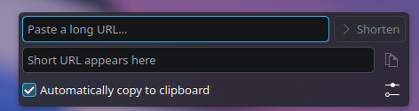
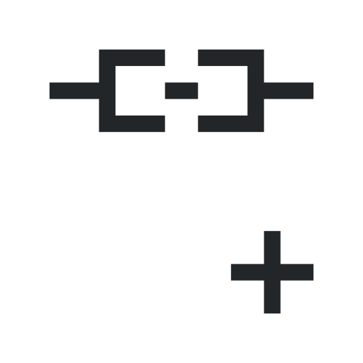

# URL Shortener (Plasma 6 Widget)

Panel icon that pops up a small field: paste a URL, press Enter or *Shorten*,
and get a short link back (da.gd, is.gd or TinyURL — whichever succeeds first) — optionally copied to the clipboard automatically.

## Install

    ./install.sh

Then right-click the panel → *Add or Manage Widgets…* → search "URL Shortener".
If it doesn't show up right away: `systemctl --user restart plasma-plasmashell`.

## Hotkey

Right-click the icon → *Configure URL Shortener…* → *Keyboard Shortcuts*.

## Test without installing

    plasmoidviewer -a package

## Uninstall

    kpackagetool6 -t Plasma/Applet -r org.kde.plasma.urlshortener

## Service order

Click the ⚙ button in the popup (or right-click → *Configure URL Shortener…*)
and use the arrows to reorder the services. They are tried top to bottom.

## License

The code is licensed under the [MIT License](LICENSE).

## Credits

The logo (`img/logo.png`) is based on the `insert-link` icon from [Breeze Icons](https://invent.kde.org/frameworks/breeze-icons) by the KDE Visual Design Group, licensed under [LGPL-3.0-or-later](https://www.gnu.org/licenses/lgpl-3.0.html).
It is not covered by the MIT License.
